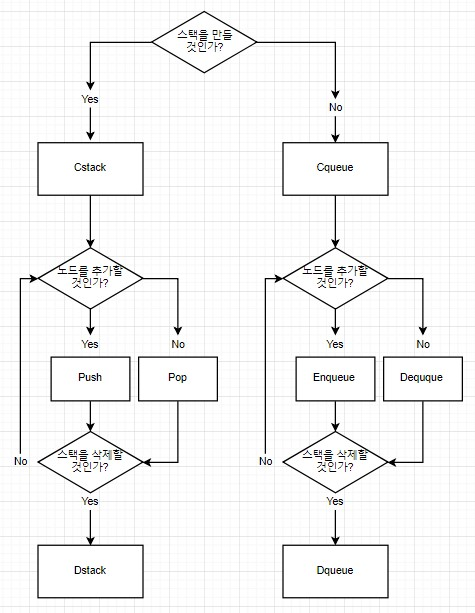
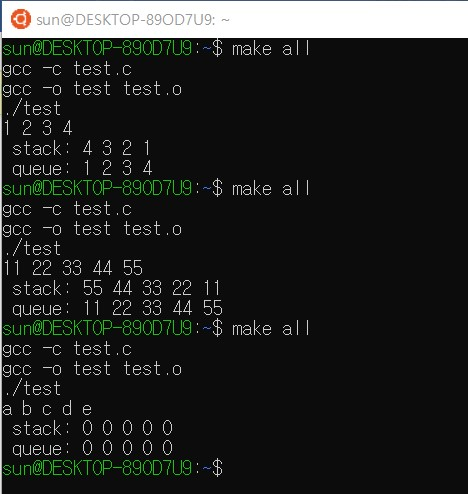
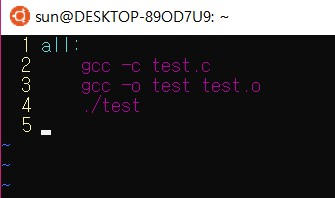

# 운영체제 H.W1       2017114559 박선우

# 1. 개요

숫자를 문자열로 입력받아 토큰화한 후 스택과 큐에 넣어서 출력을 확인하는 프로그램

# 2. 프로그램 구조 설명

## 2.1) 함수에 대한 설명

Cstack : 스택을 생성한다.

Push : 스택과 보이트형 데이터를 받아와 스택에 새로운 데이터를 추가한다.

Pop : 스택 맨 위의 노드를 제거하고 데이터를 반환한다.

Dstack : 스택을 제거한다.

Cqueue : 큐를 생성한다.

Enqueue : 큐와 보이드 형태의 데이터 주소를 받아와 큐에 데이터를 추가한다.

Dequeue : 큐의 맨 앞 노드를 제거하고 데이터를 반환한다.

Dqueue : 큐를 제거한다.

## 2.2) 다이어그램



## 3. 실행 결과



# 4. 고찰

이번 숙제를 하며 자료구조 시간에 배웠던 스택과 큐를 다시 사용하며 구조와 동작원리를 더 자세히 알아보았다.

이전에 공부하면서 짰던 코드를 다시 보면서 했는데 타입 캐스팅 에러가 자꾸 발생하였다. 그 원인은 알고 보니 보이드 포인터형 변수를 입력해야 하는데 인트형 자료를 바로 넣어서 발생하는 문제였다. 그래서 숫자 배열의 주소를 나타내기 위해 앞에 &amp;를 추가해주니 정상적으로 잘 돌아갔다. 처음 scanf를 쓸 때 이것 때문에 고생했는데 이번에도 &amp;때문에 에러가 난 걸 생각하니 정말 사소하면서도 중요한 것이구나 생각했다.

그리고 이번에 처음 우분투를 사용하였는데, 코드를 짜는 것은 어렵지 않았는데 우분투 사용법을 익히는데 정말로 힘들었다. 처음 설치부터 환경 설정까지 인터넷 하나하나 찾아보면서 하느라 코딩보다 앞의 준비과정이 더 오래 걸린 것 같다. 우분투를 처음 사용하는 사람도 많을 텐데 설치 방법만 올려주지 말고 기본적인 명령어나 사용 방법을 자세히 알려주면 좋을 것 같다.

그리고 프로그래밍을 할 때 왜 리눅스 환경에서 하는지 궁금하였다. 윈도우 비주얼스튜디오에서 코딩하는 것과 어떤 차이가 있는지 왜 보통 컴퓨터는 윈도우인데 리눅스를 쓰는지 의문이 들었다.

이번 숙제를 하면서 노드, 큐, 스택의 구조와 자료를 전달할 때 포인터가 어떻게 사용되는지에 대한 개념이 잡힌 것 같다.

# 5. 프로그램 소스 코드
```

#pragmawarning(disable:4996)

#include\&lt;stdio.h\&gt;

#include\&lt;string.h\&gt;

#include\&lt;stdlib.h\&gt;

typedefstructnode {                                //node 정의

        void\* datap;                                //data 저장할 주소

        structnode\* nextp;                        //다음 노드 주소를 가리킬 주소

}node;

typedefstruct {                                        //stack 정의

        int\* count;                                //stack 의 노드 갯수

        structnode\* top;                        //top의 주소를 가리킬 주소

}stack;
```
### create stack
```
stack\* cstack()                                        

{

        stack \*st;

        st = (stack\*)malloc(sizeof(stack));        //stack에 메모리 할당

        st-\&gt;count = 0;                                //초기 스택노드 갯수 초기화

        st-\&gt;top = NULL;                                //초기 탑 주소 초기화

        return st;

}
```
### push
```
void push(stack\* st, void\* itemp)                        //push 함수

{

        node \*newn;                                //새로운 노드 newn 생성

        newn = (node\*)malloc(sizeof(node));        //newn 에 메모리 할당

        if (newn == NULL)                        //메모리 할당이 안될 경우 종료

                return;

        newn-\&gt;datap = itemp;                        //newn의 데이터 주소에 입력받은 정보 저장

        newn-\&gt;nextp = st-\&gt;top;                        //newn의 다음 주소에 현재 스택의 탑 주소 저장

        st-\&gt;top = newn;                                //스택 탑주소에 newn 주소 저장

        st-\&gt;count++;                                //스택 노드갯수 +1

}
```
### pop
```

int pop(stack\* st)                                //pop 함수

{

        if (st-\&gt;count == 0)                        //스택 노드 갯수가 0이면 종료

                return 0;

        else {

                int topdata;                        //탑노드 정보를 저장할 변수 선언

                node \*oldtop = st-\&gt;top;                //탑노드 주소를 저장할 노드주소 선언

                topdata = \*(int\*)oldtop-\&gt;datap;        //탑노드 정보 int변수에 저장

                st-\&gt;top = oldtop-\&gt;nextp;                //탑노드 주소에 다음노드 주소 저장

                free(oldtop);                        //이전 탑노드 메모리 할당 해제

                st-\&gt;count--;                        //스택 노드갯수 -1

                return topdata;                        //탑 데이터 반환

        }

}
```
### delete stack
```

void dstack(stack\* st)                        //stack 삭제 함수

{

        while (st-\&gt;count != 0) {                //노드 갯수가 0이 될때까지 pop 반복

                pop(st);

        }

        free(st);                        //스택 메모리 할당 해제

}
```
### queue
```
typedefstruct {                                //queue 정의

        int count;                        //큐 노드 갯수

        structnode\* front;                //큐의 첫노드 주소

        structnode\* rear;                //큐의 끝노드 주소

}queue;
```
### create queue
```
queue\* cqueue()                                        //queue 생성

{

        queue \*qu;

        qu = (queue\*)malloc(sizeof(queue));        //큐에 메모리 할당

        qu-\&gt;count = 0;                                //큐의 노드갯수, 앞/끝부분 주소 초기화

        qu-\&gt;front = NULL;

        qu-\&gt;rear = NULL;

        return qu;

}
```
### enqueue
```
void enqueue(queue\* qu, void\* itemp)                //enqueue 함수

{

        node \*newn = (node\*)malloc(sizeof(node));        //새 노드 newn에 메모리 할당

        if (newn == NULL)                        //메모리 할당 실패시 종료

                return;

        elseif (qu-\&gt;count == 0)                        //큐 노드갯수 0일 때

        {

                newn-\&gt;datap = itemp;                //newn에 입력 데이터 저장

                qu-\&gt;front = newn;                // qu의 앞과 끝 주소에 newn 주소 저장

                qu-\&gt;rear = newn;

                newn-\&gt;nextp = NULL;                //newn의 다음주소는 NULL로 초기화

                qu-\&gt;count++;

        }

        else

        {                                        //큐에 노드가 하나이상 있을 때

                node\* t = qu-\&gt;rear;                //이전 노드 포인터 t 선언

                newn-\&gt;datap = itemp;

                t-\&gt;nextp = newn;                        //이전 노드의 다음주소에 newn주소 저장

                qu-\&gt;rear = newn;

                newn-\&gt;nextp = NULL;

                qu-\&gt;count++;

        }

}
```
### dequeue
```
int dequeue(queue\* qu)                                //dequeue 함수

{

        if (qu-\&gt;count == 0)                        //큐 노드갯수 0이면 종료

                return 0;

        elseif (qu-\&gt;count == 1) {                //큐 노드갯수 1개일때

                node\* t = qu-\&gt;front;                //앞 노드 주소를 저장할 포인터 t 선언

                qu-\&gt;front = NULL;                //큐의 앞과 뒤 노드 초기화

                qu-\&gt;rear = NULL;

                qu-\&gt;count--;

                int item = \*(int\*)t-\&gt;datap;        //맨앞 노드 데이터 저장

                free(t);                                //맨앞 노드 메모리 할당 해제

                return item;

        }

        else {                                        //큐 노드갯수 여러개일때

                node\* t = qu-\&gt;front;

                qu-\&gt;front = t-\&gt;nextp;                //큐의 맨앞에 주소를 다음 노드 주소로 바꿈

                qu-\&gt;count--;

                int item = \*(int\*)t-\&gt;datap;

                free(t);

                return item;

        }

}
```
### delete queue
```
void dqueue(queue\* qu)                        //큐 삭제 함수

{

        while (qu-\&gt;count != 0)                //큐 노드 갯수가 0이 될 때까지 디큐한다

        {

                dequeue(qu);

        }

        free(qu);                        //큐 메모리 할당 해제

}
```
### main
```
int main(void) {

        char s1[100];                        //입력받을 문자열 선언

        int s2[100];                        //숫자 배열 선언

        int countnum = 0;                //입력 숫자 카운터 선언

        int num, i;

        fgets(s1, 100, stdin);                //문자열 입력 받기

        char \*ptr = strtok(s1, &quot; &quot;);        //입력받은 문자열 strtok로 나누기

        while (ptr != NULL)

        {

                num = atoi(ptr);                        //문자열 -\&gt; 숫자 변환 함수 사용

                s2[countnum++] = num;                //변환값 숫자 배열에 저장

                ptr = strtok(NULL, &quot; &quot;);

        }

        printf(&quot; stack: &quot;);

        stack\* stack = cstack();                        //스택 생성

        for (i = 0; i \&lt; countnum; i++) {

                push(stack, &amp;s2[i]);                //스택에 숫자 배열 push

        }

        for (i = 0; i \&lt; countnum; i++) {

                printf(&quot;%d &quot;, pop(stack));        //pop 으로 출력

        }

        dstack(stack);                                //스택 삭제

        printf(&quot;\n queue: &quot;);

        queue\* queue = cqueue();                        //큐 생성

        for (i = 0; i \&lt; countnum; i++) {

                enqueue(queue, &amp;s2[i]);                //큐에 숫자 배열 enqueue

        }

        for (i = 0; i \&lt; countnum; i++) {

                printf(&quot;%d &quot;, dequeue(queue));        //dequeue로 출력

        }

        dqueue(queue);                                //큐 삭제

        printf(&quot;\n&quot;);

        return 0;

}
```

### makefile
 

# 6. 자료 출처

자료구조 배울 때 내가 짠 큐와 스택 코드 참조

포인터 설명

[https://citynetc.tistory.com/64](https://citynetc.tistory.com/64)

다이어그램 만드는 사이트

[https://www.draw.io/](https://www.draw.io/)

vim 사용법

[https://nolboo.kim/blog/2016/11/15/vim-for-beginner/](https://nolboo.kim/blog/2016/11/15/vim-for-beginner/)

strtok 함수

[https://dojang.io/mod/page/view.php?id=376](https://dojang.io/mod/page/view.php?id=376)

atoi 함수

[https://dojang.io/mod/page/view.php?id=385](https://dojang.io/mod/page/view.php?id=385)
