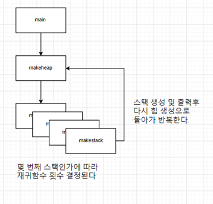
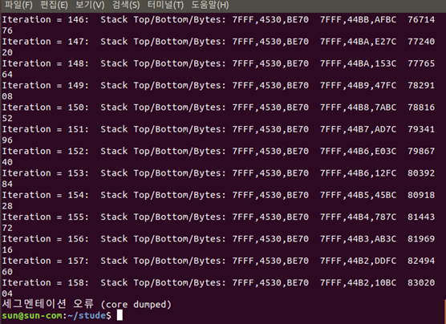
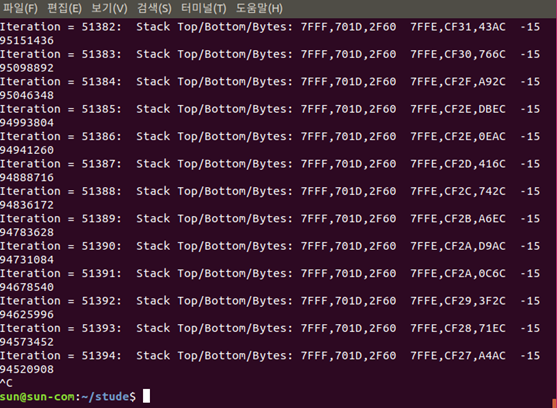
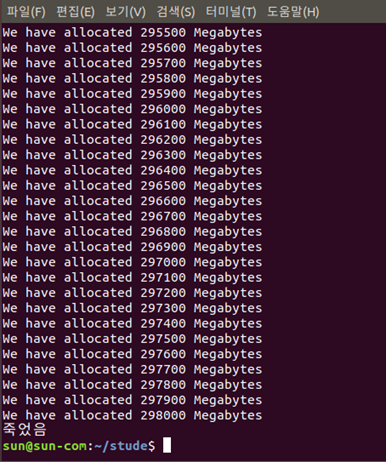
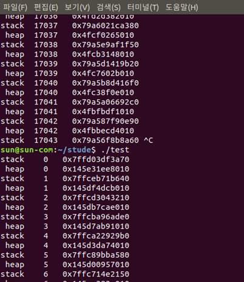
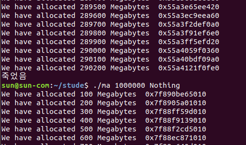
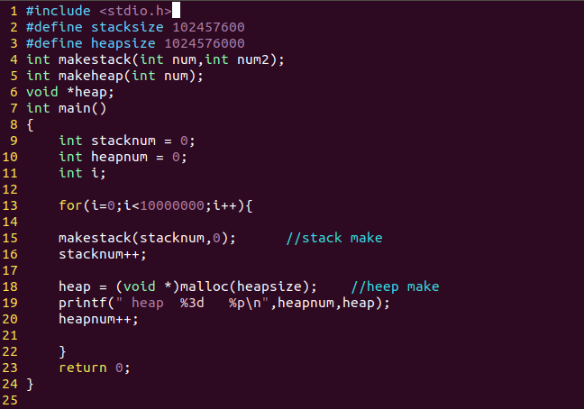
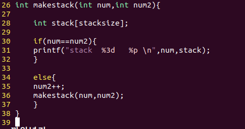

# [운영체제](../README.md) 
## H.W 4
### 2017114559	박선우
# 1.	개요
  - Stack과 Heap이 공유하는 메모리 Segment를 확인해본다.
# 2.	프로그램 구조 설명
## 2.1) 함수에 대한 설명

- Main : 스택과 힙을 번갈아가며 만들면서 데이터 주소를 표시하여 어디에서 힙과 스택이 만나는지 확인한다.

- Makestack : 

  스택의 데이터는 함수가 종료되면 사라지기 때문에 그냥 함수를 반복하는 방법이 아닌	 재귀함수를 이용하여 변수를 생성하여 주소를 확인해야 한다.
  
  이를 위해 스택이 사용된 횟수만큼 재귀함수로 변수를 생성하여 제일 마지막으로 생성된 변수의 주소와 몇 번째 스택인지를 표시한다.

## 2.2) 다이어그램

 
 
# 3.	실행 결과
## 1-1 예제코드 recursivecall.c 실행 결과

 
 
 코드를 여러 번 실행해 보았지만 모두 정확히 158번째에서 세그멘테이션 오류가 발생하였다. 
 
 인터넷에 찾아보니 리눅스에서 스택 메모리 크기를 제한하여 일정 크기가 넘어가면 에러가 발생하도록 설정이 되어있다고 한다. 
 
 그래서 스택 메모리 제한 해제 명령어인 ulimit -s unlimited 를 입력한 뒤에 다시한번 실행해 보았다.
 
## 1-2 예제코드 recursivecall.c 실행 결과2

 
 
 놀랍게도 158을 넘어서 계속 실행되다가 200000번째를 넘어가면 컴퓨터가 그대로 멈춰버린다.
 
 왜 리눅스에서 스택 메모리를 제한했는지 알 것 같다.

 
## 2 예제 코드 malloctoomuch.c 실행 결과

 
 
 대략 300000 메가바이트 정도를 할당한 후 끝이 났다. 이것으로 힙의 크기를 대략적으로 파악할 수 있다.
 
## 3 test 코드 실행 결과

 
 
 프로그램이 끝날 기미가 보이지 않아 중간에 종료한 뒤 다시 시작하여 스택과 힙의 시작과 끝 주소를 확인하였다.
 
 - Stack 시작 : 0x 7ffd 03df 3a70
 - Stack 끝   : 0x 79a5 6f8b 8a60
 - Heap 시작 : 0x 145e 31ee 8010
 - Heap 끝   : 0x 04fb becd 4010
 
 스택의 주소는 메모리 끝에서 시작하여 정상적으로 감소하였지만 힙의 주소는 메모리 앞부분에서 시작하여 감소하였다.
 
 원래라면 증가해야 하는데 이상해서 malloctoomuch.c 예제코드를 수정하여 주소를 확인해 보았다.

## 4 malloctoomuch.c 코드 수정 결과

 
 
 예제 코드에서도 똑같이 힙의 주소가 데이터 앞쪽에서 점점 감소하는 것을 확인할 수 있었다.
 
 힙의 시작 주소와 끝난 주소를 비교해보면 힙의 주소는 대략 0x 55a4 121f 0fe0 ~ 0x 7f89 0be6 5010 인 것을 확인할 수 있다

# 4.	고찰

- 알아낸 사실
리눅스에서는 스택 메모리 크기를 제한하는데 이것을 넘어가면 코어 덤프 오류가 발생한다.

이를 해결하기 위해서 ulimit -s unlimited 명령어를 사용할 수 있다.

Stack size를 할당할 때 100000000 (1억) 자리 수 까지만 할당할 수 있다 0을 하나 더 붙이면 코어 덤프 오류 가 발생했다.

Heap size를 할당할 때 malloc에는 최대 1000000000 (10억) 자리 까지만 가능했다. 0을 더 붙이면 주소값이 nil으로 표시되었다. 

이번 과제는 간단해 보였지만 생각보다 많이 힘들었다. 

일단 예제코드를 참고하면서 프로그램을 짜 보았지만 생각보다 힙과 스택의 메모리 공간이 너무 커서 프로그램을 실행하고 오래 기다려 보았지만 메가바이트 단위로는 서로가 만날 때까지 할당할 수가 없었다. 

그래서 시도한 방법이 할당할 메모리 크기를 아주 크게 하면 어떨까 해서 해보았지만 위의 알아낸 사실과 같이 특정 크기 이상 메모리를 할당하려 하면 에러가 발생하였다. 

이 두가지 문제로 인하여 정확히 어느 지점에서 힙과 스택이 만나는지는 밝혀내지 못하였지만 이론상으로 프로그램을 계속 돌려서 메모리를 할당한다면 전체 메모리 크기는 한정돼 있으므로 언젠가는 힙과 스택이 만날 것이다. 

그리고 프로그래밍한 결과를 보면서 가장 의아했던 점이 어째서 힙의 주소가 앞쪽에서 증가하는 방향이 아닌 감소하는 쪽으로 나타나는 것인지 잘 모르겠다. 

내가 코드를 잘못 짠 건가 싶어 에제 코드를 수정하여 확인해 보았지만 예제 코드에서도 같은 현상이 나타나는 것으로 보아 내 리눅스 환경 또는 예제 코드의 문제가 아닐까 생각한다.

원래 과제를 할 때 윈도우에서 제공하는 우분투 어플리케이션으로 과제를 해왔는데 이 환경에서는 ulimit -s unlimited 명령어가 먹히지 않아 어쩔 수 없이 VMware에 설치한 우분투 환경에서 과제를 진행했다. 

# 5.	프로그램 소스 코드

 
 
 
# 6.	자료 출처

조교님이 올려주신 malloctoomuch.c , recursivecall.c 예제 참조

다이어그램 만드는 사이트
https://www.draw.io/

리눅스, 프로세스가 사용하는 시스템자원 제한하기
http://blog.naver.com/PostView.nhn?blogId=dudwo567890&logNo=130156432746
