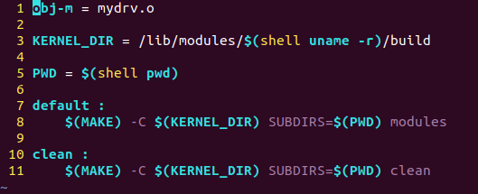

# [운영체제](../README.md) 
## H.W 5
### 2017114559	박선우
# 1.	개요
  - 유저 프로그램에서 문자를 입력받아 대소문자 변환하여 저장, 
  
     총 100개의 문자를 저장하고 100개가 넘는 입력에 대해서는 처음부터 Overwrite 하는 메모리 디바이스 드라이버 만들기
     
# 2.	프로그램 구조 설명

## 2.1) 함수에 대한 설명

### Test_app.c
- Write : 메모리 디바이스 드라이버에 정보를 저장하는 함수

- Read : 메모리 다바이스 드라이버에 저장된 정보를 반환하는 함수

### Mydrv.c
- Mydrv_open : 디바이스 드라이버를 열 때 호출하는 함수

- Mydrv_release : 디바이스 드라이버를 닫을 때 호출하는 함수

- Mydrv_read : 디바이스 드라이버를 읽을 때 호출하는 함수
  
  (여기에 대소문자 변환과 오버라이팅 하는 코드를 추가하여 읽어올 때 변환된 값을 읽도록 만들었다.)

- Mydrv_write : 디바이스 드라이버에 쓸 때 호출하는 함수

## 2.2) 다이어그램

 
 
# 3.	실행 결과
## 1-1 예제코드 recursivecall.c 실행 결과

 같은 코드인데도 내 노트북의 VMware 환경에서는 계속 에러가 발생하여 다른 노트북을 빌려 VirtualBox 환경에서 실행하였다.

 
 
 A ~ G까지를 대소문자를 섞어 여러 번 입력한 결과 100번째 이후 F~G는 다시 A자리에 오버라이팅 되어 A대신 F ~ G가 나타나는 것을 볼 수 있다.
 
 대소문자 변환도 잘 되었다.

 하지만 내 노트북 환경에서는 에러가 발생하였다.
 
 

# 4.	고찰

기본적인 코드는 ppt예제를 따라했고 대소문자 변환과 오버라이팅 하는 코드만 mydrv_read 함수 부분에 추가하였다.

mydrv_write가 아닌 read함수에 변환코드를 넣은 이유는 mydrv_write의 인자 buf가 const char*로 설정되어 있어서 buf를 변경하려 하면 에러가 발생했기 때문에 buf인자가 char*로 설정되어 있는 mydrv_read 함수에 코드를 추가하였다.

또 test_app.c 코드에 정의된 MAX_SIZE를 1000으로 설정하여 100개 이상의 문자를 입력 받을 수 있도록 하였다. 

코드를 그대로 실행했는데도 두 컴퓨터에서 다른 결과가 나온 것을 보면 내 노트북의 리눅스 환경설정이 잘못되어 있는 것 같다. 

내 노트북의 VMware 환경에서는 인자 buf를 수정하려 하면 “죽었음” 이라는 오류 메시지만 출력되어 어디에서 어떤 문제가 발생한 것인지는 정확히 파악하지 못했다.

코드를 짜면서 이상했던 점은 mydrv_read 함수 안에서 if문에서 실행되는 copy_to_user 앞에 변환코드가 있어야 변환하고 read가 될 것 같은데 그렇게 하면 오류가 발생하고 copy_to_user 뒤에 코드를 넣으니 잘 실행되었다.

또 오버라이팅 코드를 대소문자 변환 코드 뒤쪽에 if문을 써서 추가했더니 결과가 나오지 않는 현상이 발생하였다. 그래서 대소문자 변환 if문 안쪽에 오버라이팅 코드를 넣고 실행했더니 정상적으로 동작하였다. 

얼핏 보면 같은 동작인 것 같은데 잘 모르겠지만 실행하면서 겪은 바로는 코드의 위치가 동작에 큰 영향을 미친다 라는 결론을 얻을 수 있었다.

마지막 숙제는 꽤 간단해 보였는데 내 노트북에서 발생하는 에러가 내 코드 문제인줄 알고 여러 방법으로 시도해 보았지만 다 실패하여 마지막으로 동아리 형한테 부탁하여 다른 노트북에서 돌려보니 정상적으로 실행되었다. 이 문제 때문에 이틀간 고생하다 결국 다른 노트북을 빌려 숙제를 완성하였다. 

대소문자 변환만 잘 해결하니 그 뒤의 오버라이팅 부분은 쉽게 해결한 것 같다. 

이번 숙제를 하며 유저 프로그램과 디바이스 드라이버가 어떤 식으로 동작하는지 개념을 알게 된 것 같다. 또 디바이스 드라이버 코딩이 쉽지 않다는 것을 느꼇다.

# 5.	프로그램 소스 코드

 
 
 
 코드 추가한 부분 (여기에 대소문자 변환 코드, 100번째 넘어가면 오버라이팅 하는 코드를 추가하였다.)
 
 
 
 
 
 
 
 - Test_app.c
 
 
 
 - Makefile
 
 
 
# 6.	자료 출처

Device Management ppt 예제 코드 참고

다이어그램 만드는 사이트
https://www.draw.io/

대소문자 변환 Device Driver 만들기
https://cccding.tistory.com/88
